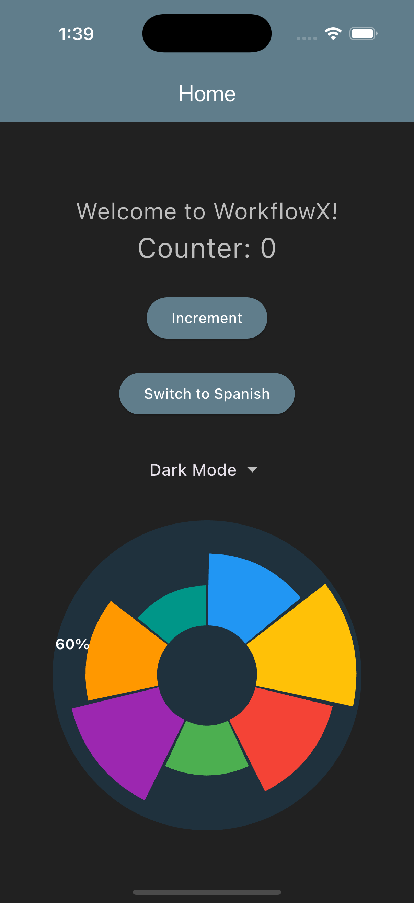

# Radial Chart Package

A reusable, interactive radial chart widget for Flutter. Supports dynamic thickness, animated selection, and custom labels.

## 📸 Preview

{ width=300px }

## 🚀 Features

- Dynamic segment thickness based on percentage
- Animated segment selection
- Optional labels
- Configurable center radius, gap, and outer size

## 🛠 Usage

```dart
RadialPerformanceChart(
  radius: 150,
  segments: [
    SegmentData(percentage: 72, color: Colors.blue, label: "72%"),
    SegmentData(percentage: 100, color: Colors.amber, label: "100%"),
    // ...
  ],
)
